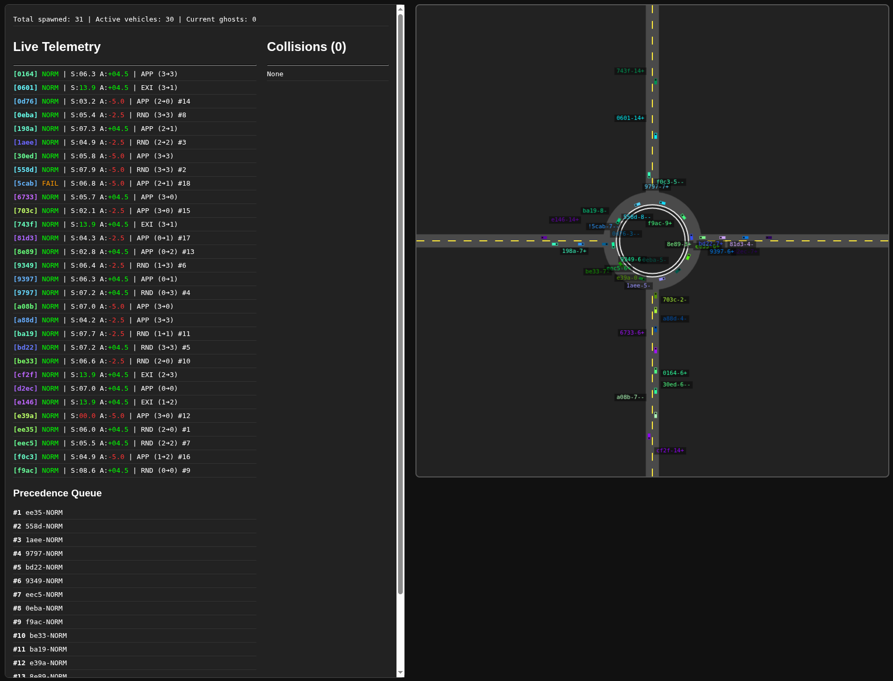

# Smart Roundabout Controller
Project for the Distributed Systems course at University of Bologna 2025/2026. A simulation of a **Distributed Cyber-Physical System (CPS)** managing a "Smart Roundabout".  



## Requirements

- docker engine
- docker compose v2
- leave the docker ports free (currently, only 8080 for the webviewer)


## Usage

```bash
git clone https://github.com/papum20/unibo\_\_projects\_\_distributed-smart-roundabout.git
```

The following commands can be run from the project root.  
To start all services:
```bash
./src/start.sh
```

To stop all services:
```bash
./src/down.sh
```

Simulation's viewer available at the page: http://localhost:8080  
* `spacebar` : pause/resume simulation

`ctrl.sh` is a wrapper command to interact with the web server's http endpoints.  
It requires a command (entire word or single letter), followed by a one or two digits number to pick some random vehicles, an id's prefix for a specific vehicle, or nothing to address all.  
```bash
# Usage: src/ctrl.sh {PAUSE|RESUME|FAILSAFE|CONTROLLER|DISCONNECT|RECONNECT} [vehicle-id|vehicle-count]
# or src/ctrl.sh {p|r|f|c|d|n} [vehicle-id|vehicle-count]

# pause/resume simulation
./src/ctrl.sh p
./src/pause.sh r
./src/ctrl.sh resume vehicle_id
# enter failsafe
./src/ctrl.sh f
# exit failsafe, for vehicle with ID starting with 4fd2
./src/ctrl.sh c 4fd2
# mark 10 random vehicles as disconnected
./src/ctrl.sh d 10
# exit disconnected
./src/ctrl.sh n
```

### Configuration

Configuration variables:
* `.env` for docker compose
* `src/common/const.py` for the services variables


### Testing

To run tests, pytest has been used.  
The services requirements are needed. This requirements file includes pytest as well:
```bash
pip install -r src/tests/requirements.txt
```

From the root directory, run all the tests with:
```bash
pytest
```

## Project report

https://github.com/papum20/unibo__projects__distributed-report  
